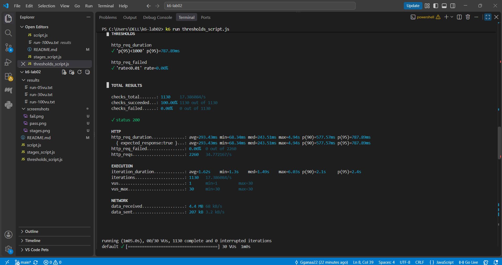
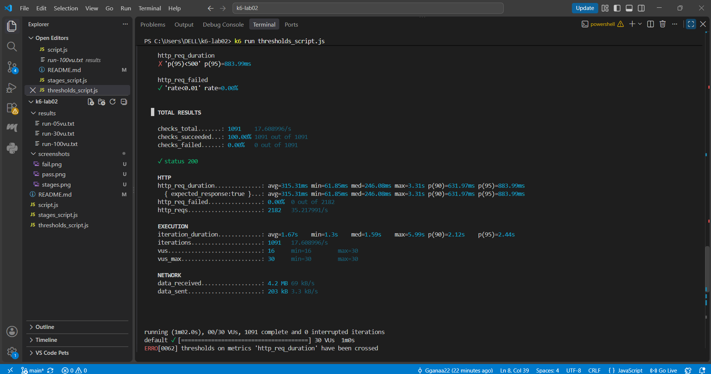
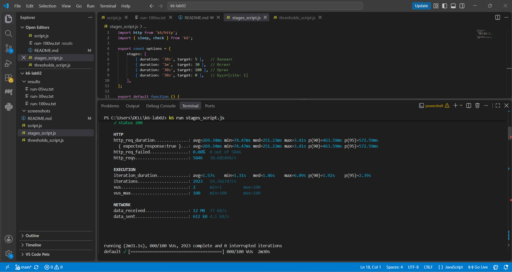

# Lab 02: Гүйцэтгэлийн хэмжүүрийг k6-аар хэмжих

## 1. k6 Version

k6 v2.2.0 (commit/00a9a1b7f5, go1.26.5, windows/amd64)

## 2. Гурван түвшний (5/30/100 VU) хэмжилтийн хүснэгт

| VU Түвшин | http_req_duration (p90) | http_req_duration (p95) | Throughput (http_reqs/s) | Error Rate (http_req_failed) |
| :--- | :--- | :--- | :--- | :--- |
| **5 VU** | 980.92ms | 1.26s | 5.19 reqs/s | 0.00% |
| **30 VU** | 976.94ms | 1.19s | 31.26 reqs/s | 0.00% |
| **100 VU** | 1.05s | 1.26s | 90.98 reqs/s | 0.00% |

## 3. SLO (Threshold) Үндэслэл
Манай baseline (5 VU болон 30 VU) хэмжилт дээр үндэслэн гадаад сүлжээний хэлбэлзэл болон сервер дээрх зэрэгцээ ачааллын өсөлтийг тооцоолж, SLO threshold-ийг `p(95) < 1500ms` (1.5s) болон `http_req_failed < 1%` байхаар тохируулсан. `thresholds_script.js` дээр уг утгаар PASS үр дүн авсан бөгөөд хатуу тохируулж (500ms) FAIL үр дүнг шалгаж баталгаажуулсан.

## 4. Дэлгэцийн зургууд

### Threshold PASS

### Threshold FAIL

### Stages Test Output

## 5. Дүгнэлт
Ачаалал 5-аас 100 VU болж өсөхөд системд хэд хэдэн тодорхой өөрчлөлтүүд ажиглагдлаа. 
1. VU-ийн тоо 5-аас 30 болон 100 болж өсөхөд Throughput (секундэд боловсруулах хүсэлтийн тоо) 5.19 reqs/s-ээс 90.98 reqs/s хүртэл шугаман өсөлт үзүүлсэн.
2. Хүсэлтийн хариу хүлээх хугацаа буюу $p(90)$, $p(95)$ утгууд 5 VU болон 30 VU ачаалалтай үед ~976ms - 1.26s орчимд тогтвортой байсан бол 100 VU болоход $p(90)$ хугацаа 1.05s болон нэмэгдэж, хамгийн дээд саатал (max duration) нь 2.49s-ээс 12.32s хүртэл огцом өссөн.
3. Энэ нь Лекц 2-т үзсэн "Ачаалал өсөхөд Throughput ба Latency хоорондын зөрчил үүсдэг" онолыг баталж байна.
4. Тухайлбал, 30 VU хүртэл нэгж хэрэглэгчийн туршлага (User Experience) болон хариу өгөх хугацаа тогтвортой байсан бөгөөд $p(95)$ хугацаа зөвшөөрөгдөх хэмжээнд байв.
5. Харин 100 VU түвшинд хүрэхэд дундаж хугацаа болон магадлалт саатал өссөн тул нэгж хэрэглэгчийн туршлага муудаж эхэлсэн.
6. Тодорхойлсон SLO нь бодит сүлжээний хугацаанд тааруулсан (1500ms) үед PASS гарсан бол хатуу тохируулсан (500ms) үед FAIL болж, quality gate ажиллах зарчмыг харууллаа.
7. Туршилтаас харахад туршилтын явцад ямар нэгэн алдаа (http_req_failed: 0.00%) гараагүй боловч зэрэгцээ ачаалал ихсэх тусам max latency хэт өсөх эрсдэлтэй байна.

